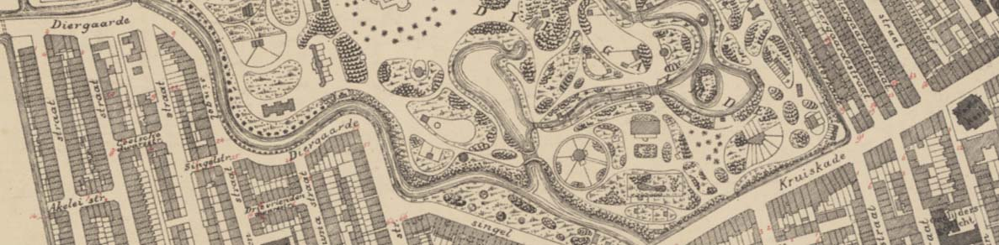
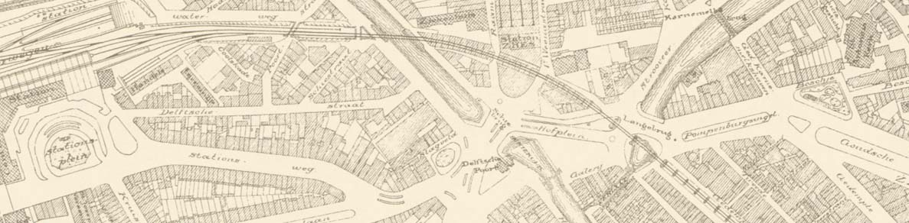
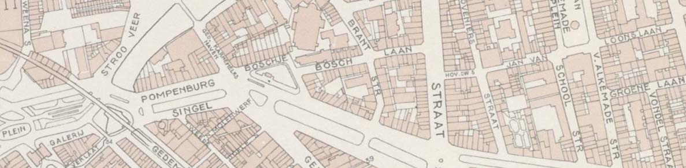
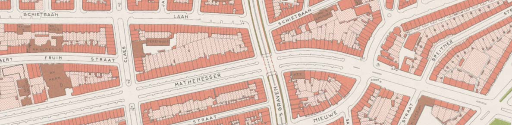
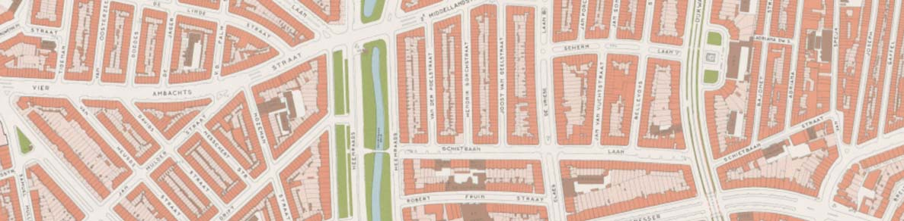

# Cartografie

Dat het Rotterdamse stratenpatroon de afgelopen eeuw nogal ingrijpend is gewijzigd behoeft geen betoog. We hebben een vijftal kaarten gegeorefereerd en als tiles beschikbaar gemaakt, zodat je een beter beeld krijgt van wat waar was.

De kaarten zijn gegeorefereerd door [Bert Spaan](https://bertspaan.nl/), met behulp van het door hem ontwikkelde [Allmaps](https://allmaps.org/). Je kunt de kaarten bekijken in de eveneens door hem gemaakte [Rotterdams Publiek Kaart](https://rotterdamspubliek.nl/plekken/kaart/).

Wil je de kaarten in je eigen applicatie, of in QGIS of bijvoorbeeld [geojson.io](http://geojson.io/) (meta > add map layer) tonen, gebruik dan de volgende urls:

### Plattegrond van Rotterdam in 12 bladen. Blad 5 - 1903

Plattegrond van Rotterdam in 12 bladen. Blad 5: Middelland; Oude Westen; Cool; Stadsdriehoek; Provenierswijk; Oude Noorden; Rubroek. Je vindt de oorspronkelijke versie [bij het Stadsarchief](https://hdl.handle.net/21.12133/3FBC044B9DE9495496E371CA571FE3A9).

`https://rotterdamspubliek.nl/tiles/NL-RtSA_4201_I-138-02-5/{z}/{x}/{y}.png`

### Plattegrond van het centrum van Rotterdam rond 1930

De plattegrond is gebaseerd op de bladen 5, 6, 8, en 9 van de Plattegrond der gemeente Rotterdam, schaal 1:5.000, respectievelijk uitgegeven in de jaren 1935, 1928, 1935 en 1926. Je vindt de oorspronkelijke versie [bij het Stadsarchief](https://hdl.handle.net/21.12133/45335C17ADFD43D58109D67954BB91FC).

`https://rotterdamspubliek.nl/tiles/NL-RtSA_4001_1985-1014-01/{z}/{x}/{y}.png`

### Kaart van het centrum van Rotterdam van voor mei 1940

In 1955 gemaakte kaart van de vooroorlogse situatie. Je vindt de oorspronkelijke versie [bij het Stadsarchief](https://hdl.handle.net/21.12133/0ECE918126BF4C3FA46C52852F801492).

`https://rotterdamspubliek.nl/tiles/NL-RtSA_4001_1972-755-1/{z}/{x}/{y}.png`

### Kaart van Rotterdam en omgeving; bestaande uit 24 bladen. Blad 10 - 1965

Kaart van Rotterdam en omgeving; bestaande uit 24 bladen. Blad 10: Blijdorp, Bergpolder, Oude Noorden, Nieuwe Westen, Middelland, Oude Westen, Cool. Je vindt de oorspronkelijke versie [bij het Stadsarchief](https://hdl.handle.net/21.12133/7F31A1A44BBF4677B8DE474D36900C71).

`https://rotterdamspubliek.nl/tiles/NL-RtSA_4201_I-259-10/{z}/{x}/{y}.png`

### Blad 10: Blijdorp, Bergpolder, Oude Noorden, Nieuwe Westen, Middelland, Oude Westen, Cool - 1969

Kaart van Rotterdam en omgeving; bestaande uit 24 bladen. Blad 10: Blijdorp, Bergpolder, Oude Noorden, Nieuwe Westen, Middelland, Oude Westen, Cool. Je vindt de oorspronkelijke versie [bij het Stadsarchief](https://hdl.handle.net/21.12133/6C1D0ED38BB04672B07C3EEACE6B08D4).

`https://rotterdamspubliek.nl/tiles/NL-RtSA_4201_1970-2043/{z}/{x}/{y}.png`

