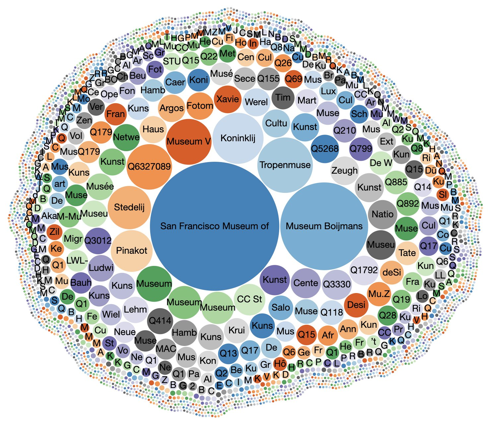

# Data Rotterdams Publiek

Binnen het project Rotterdams Publiek hebben we data uit verschillende bronnen verbonden om zo een beeld te geven van het culturele verleden van Rotterdam. Op de website [rotterdamspubliek.nl](https://rotterdamspubliek.nl/) is te zien in hoeverre we daar in geslaagd zijn.

Zelf hebben we, vaak om al beschikbare data te verbinden, ook data gemaakt. Deze data is deels hier, onder een CC0 licentie, te vinden. Waar mogelijk hebben we data op Wikidata gezet of aangevuld.

### Uitgaansgelegenheden op Wikidata

Voor veel uitgaansgelegenheden hebben we op Wikidata items aangemaakt en / of aangevuld met relevante informatie - dateringen, verschillende namen, architecten, identifiers in andere datasets, afbeeldingen, etc. 

Het resultaat daarvan is te zien op [rotterdamspubliek.nl/plekken](https://rotterdamspubliek.nl/plekken/), de achterliggende query vind je [hier](wikidata.md).

### Krantenartikelen uit Delpher

Om bioscopen, theaters en andere uitgaansgelegenheden, waar soms geen of weinig afbeeldingen van zijn, verder te 'illustreren', hebben we meer dan 250 quotes uit krantenartikelen op [Delpher](https://www.delpher.nl/) verzameld. [Hier vind je](quotes.md) een voorbeeld van zo'n quote in turtle en een query waarmee je de aantallen quotes per locatie opvraagt.

### Cartografie

Dat het Rotterdamse stratenpatroon de afgelopen eeuw nogal ingrijpend is gewijzigd behoeft geen betoog. We hebben [een aantal kaarten gegeorefereerd en als tiles beschikbaar gemaakt](cartografie.md) om beter  te kunnen laten zien waar al die theaters stonden.

### Affiches

De collectie van het Stadsarchief Rotterdam telt 1700+ niet auteursrechtelijk beschermde affiches. Zo'n 130 daarvan waren te koppelen aan Rotterdamse locaties.

Het bestand [sa-affiche-links.ttl](data/sa-affiche-links.ttl) bevat links naar locaties (dct:spatial) en onderwerpen (dc:subject) - films en acteurs vooral. Uit praktische overwegingen is ook een [bestand met wat metadata van de 1700+ affiches]((data/sa-affiches.ttl)) gemaakt.

### Gebeurtenissen

Als experiment - om eens te zien wat voor 'events' zoal in beeldcollecties zijn vastgelegd - hebben we een kleine honderd gebeurtenissen verzameld en beschreven. [Hier](gebeurtenissen.md) vind je de queries waarmee je de gebeurtenissen opvraagt. Je kunt ze bekijken op [rotterdamspubliek.nl/gebeurtenissen](https://rotterdamspubliek.nl/gebeurtenissen/).

### Afbeeldingen van theaters, bioscopen, etc.

Uit de collecties van het Stadsarchief Rotterdam en, in mindere mate, het Nationaal Archief, hebben we zo'n 300 afbeeldingen gelinkt aan Wikidata identifiers van bioscopen, concertzalen, etc. 

In [afbeeldingen.md](afbeeldingen.md) word je naar bestanden verwezen die al die verbindingen bevatten. Ook vind je er een query die het aantal afbeeldingen per locatie toont.

### Filmvoorstellingen

Benieuwd naar wat er in zeg mei 1932 in welke Rotterdamse bioscoop draaide? Antwoord op die vraag vind je in [Cinema Context](http://www.cinemacontext.nl), dat duizenden filmvoorstellingen bevat. Voorbeeldqueries, informatie over het datamodel en een link naar de sparql endpoint vind je [hier](https://uvacreate.gitlab.io/cinema-context/cinema-context-rdf/).

Voorstellingen van na 1950 zijn in Cinema Context nog niet opgenomen, vandaar dat we een crowdsource project zijn gestart op [hetvolk.org](https://widgets.hetvolk.org/data-entry/start/678ec0d9-91a6-07cb-a7c9-d91c4fef852e) om filmladders uit de jaren '80 in te voeren. Die data zal na afloop van het project ook hier gepubliceerd worden. De links naar alle door ons uit Delpher geknipte filmladders zijn [nu al hier te vinden](data/filmladders-jaren-80.csv).

### Tentoonstellingen

Museum Boijmans stelde voor ons project zijn nog niet eerder gepubliceerde tentoonstellingsdata beschikbaar. We hebben voor al die bijna 1500 tentoonstellingen Wikidata-items aangemaakt en daarvandaan, voor zover mogelijk, links gelegd naar de beschrijving van de tentoonstelling op de Boijmans website. 

Daarnaast hebben we veel verbindingen gelegd naar de onderwerpen van de tentoonstellingen (kunstenaars, meestal).

Je bekijkt de tentoonstellingen in de [tijdmachine](https://rotterdamspubliek.nl/tijdmachine/?year=1968). Of op Wikidata natuurlijk, [hier](tentoonstellingen.md) vind je de queries.

_Alle tentoonstellingen op Wikidata, per museum. Het Boijmans scoort goed._

