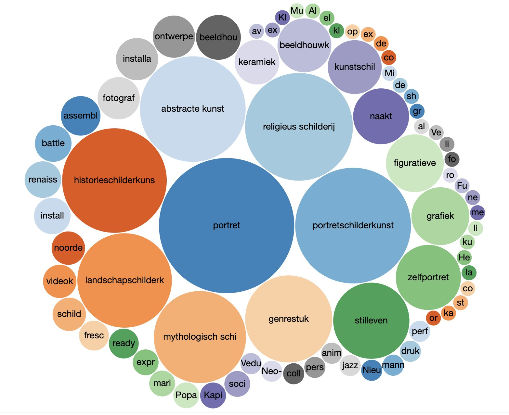

# Tentoonstellingen

Museum Boijmans stelde voor ons project zijn nog niet eerder gepubliceerde tentoonstellingsdata beschikbaar. We hebben voor al die tentoonstellingen Wikidata-items aangemaakt en daarvandaan, voor zover mogelijk, links gelegd naar de beschrijving van de tentoonstelling op de Boijmans website. 

Je bekijkt de tentoonstellingen - per jaar - in de [tijdmachine](https://rotterdamspubliek.nl/tijdmachine/?year=1968). Op de [Wikidata sparql endpoint](https://query.wikidata.org/) kan je ze opvragen met de volgende query:

```
SELECT ?i ?iLabel ?begin ?einde WHERE {
  ?i wdt:P31 wd:Q29023906 .
  ?i wdt:P276 wd:Q679527 .
  OPTIONAL{
    ?i wdt:P580 ?begin .
  }
  OPTIONAL{
    ?i wdt:P582 ?einde .
  }
  SERVICE wikibase:label { bd:serviceParam wikibase:language "[AUTO_LANGUAGE],en". }
}
ORDER BY ?begin
```


Daarnaast hebben we veel verbindingen gelegd naar de onderwerpen van de tentoonstellingen (kunstenaars, meestal). Van die kunstenaars is op Wikidata weer aangegeven in welke genres ze werkten, zodat je onderstaande query kunt draaien om te zien welke genres op die tentoonstellingen te zien geweest moeten zijn:

```
#defaultView:BubbleChart
SELECT ?genre ?genreLabel (count(?subject) as ?nr) WHERE {
  ?i wdt:P31 wd:Q29023906 .
  ?i wdt:P276 wd:Q679527 .
  ?i wdt:P921 ?subject .
  ?subject wdt:P136 ?genre .
  SERVICE wikibase:label { bd:serviceParam wikibase:language "[AUTO_LANGUAGE],en". }
}
group by ?genre ?genreLabel
order by desc (?nr)
```

En dat levert dan weer het volgende plaatje op:


